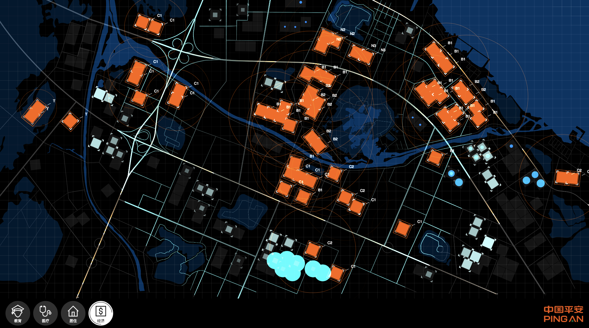

# PingAnSandbox

Visualization (and alg scaffold for future sandbox) for PingAn Tech

Uses p5.js as graphic-backend for now, will shift to GL driven frameworks for performance (like pixi.js)

-----------



-----------


`npm i http-server -g`

`http-server -o`

Default Display: 1920 x 1080 (GPU Enabled)

Modify ```Scale``` if needed (for 4k displays)

Hit F11 & go fullscreen


TODO:

Touch & Object Recognition


Note: No proprietary technology related to / developed by PingAn group is used or included. 